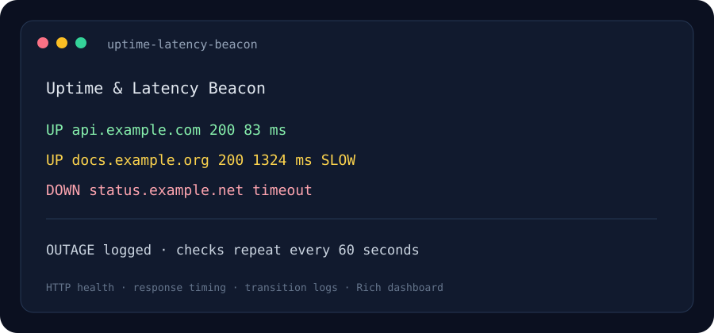

# Uptime & Latency Beacon

A terminal dashboard that checks a list of HTTP endpoints, measures response time, marks slow responses, and logs outages and recoveries.

> The image above is an illustrative dashboard preview.

## Problem it solves

Small services still need a clear signal when an endpoint stops responding or becomes unusually slow. This project provides a configurable, local monitor for a few websites or health endpoints.

## Quick start

Requires Python 3.10 or later.

~~~powershell
python -m venv .venv
.venv\Scripts\Activate.ps1
python -m pip install -r requirements.txt
Copy-Item targets.example.json targets.json
python -m uptime_latency_beacon --config targets.json --once
~~~

Remove --once to keep the dashboard running. The default interval is 60 seconds.

## Configure targets

Each target has a display name, URL, timeout, slow-response threshold in milliseconds, and list of expected HTTP status codes. Configure /health endpoints where possible instead of fetching full web pages.

## How it works

1. httpx sends a GET request with redirects enabled and a per-target timeout.
2. The monitor measures request duration with a monotonic performance clock.
3. Rich displays status, HTTP code, latency, and details in a terminal table.
4. State transitions are written to outages.log; slow responses are warnings.
5. A small local state file remembers the previous state so recovery events are visible.

## Project layout

- **uptime_latency_beacon/monitor.py** — probes, latency classification, and transition logging.
- **uptime_latency_beacon/cli.py** — configuration, schedule, and live dashboard.
- **targets.example.json** — sample target definitions.
- **assets/preview.svg** — illustrative dashboard preview.

## Tech stack

Python · httpx · Rich · JSON · logging

## Operating notes

This checks HTTP responses, not ICMP ping. It is intended for personal or development monitoring, not a substitute for a distributed production monitoring service. Keep polling intervals reasonable and monitor endpoints you own or are allowed to query.

## License

MIT.
